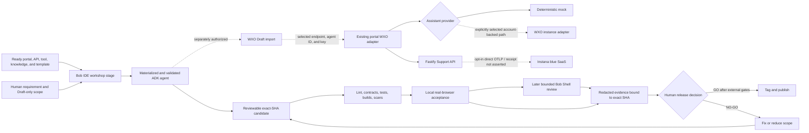

# From idea to controlled release with IBM Bob

Prepared and maintained by [AlexMlodawski](https://github.com/AlexMlodawski).
Some code and documentation were drafted or refined with AI assistance; the
maintainer reviewed, edited, and tested the result. See [AI_USAGE.md](AI_USAGE.md).

An independent, end-to-end case study of turning a workshop-ready backend,
read-only tool, knowledge base, and agent template into a **watsonx Orchestrate
Draft** agent with **IBM Bob IDE**, connecting the existing portal to that agent,
then validating the exact candidate with deterministic tests and an optional,
bounded **Bob Shell** review in CI/CD.

The fictional Acme product makes the lifecycle concrete: Git supplies the portal,
Support API, agent template, tool, knowledge, and tests; Bob IDE guides the
model-specific materialization and separately authorized Draft import; the existing
portal can then use its server-side WXO adapter; local automation validates the
exact candidate; Bob Shell can later add advisory findings; and a human retains the
release decision.

The `v0.1.0` scope remains deliberately bounded. It is a reproducible educational
lab, not a production service, proof of a tenant deployment, or an autonomous
release platform.

> Deterministic checks produce evidence. A human owns the release decision.


The screenshot shows fictional data in local **mock** mode.

## The case-study path

1. A human defines the use case, Draft-only target, and non-negotiable safety
   boundaries.
2. The workshop starts in Bob IDE with a ready Support API, read-only order tool,
   knowledge base, native-agent template, fixtures, and validation scripts.
3. Bob IDE helps materialize the model-specific definition, run offline validation,
   and, only after a separate human check, import the reviewed agent into Draft.
4. The existing portal is connected to that selected WXO agent through its
   server-side adapter; the guided launcher does not perform the import or infer the
   environment state.
5. The guided launcher may independently enable direct Instana blue SaaS OTLP/HTTP
   export from the Support API, without installing a system agent or collector.
6. Deterministic CI runs contracts, tests, scans, builds, and browser journeys.
7. A later manual exact-SHA workflow can run a bounded, read-only Bob Shell advisory
   review after all deterministic gates pass.
8. A human reviews each separate evidence claim and decides whether to release.

Read the complete [case study](docs/case-study.md), [workshop guide](docs/workshop.md),
and [Bob Shell CI/CD control model](docs/bob-shell-cicd.md).

## Evidence status

| Claim | Current repository evidence |
| --- | --- |
| Local portal, API, assistant, and support flow | Implemented and deterministically testable |
| watsonx Orchestrate ADK artifacts | Versioned and validated offline |
| Import into watsonx Orchestrate Draft | Prepared and documented; authenticated import `not_asserted` |
| Existing portal connected to a selected WXO agent | Server-side adapter implemented; authenticated tenant routing `not_asserted` |
| Deployment to watsonx Orchestrate Live | Out of scope and `not_asserted` |
| Direct Instana OTLP/HTTP export | Opt-in guided runtime path and local wire tests implemented; tenant receipt and indexing `not_asserted` |
| Bob IDE workflow | Plan-first workflow is documented; private session details are not part of the repository |
| Bob Shell CI/CD controller | Implemented and locally contract-tested |
| Authenticated Bob Shell review | Determined per exact candidate from a validated protected-run artifact; without one the claim is `not_asserted` |
| Release approval | Human-owned; no automated approval |

## What is validated locally

- A Next.js portal and Fastify Support API run on loopback with synthetic Acme data.
- A deterministic contextual assistant explains fictional order status and policy.
- Support-case creation returns a correlated, non-persistent sample acknowledgement.
- Unit, integration, OpenAPI, Python, and Playwright suites exercise the local path.
- Browser acceptance covers both development and fresh production-build profiles,
  including invalid and missing-order behavior.
- Current-tree and full reachable-history scanners report only safe counts/statuses.
- An offline generator combines locked npm and Python components into CycloneDX 1.6.
- A Full release audit binds redacted evidence to one exact Git commit and fails on
  any incomplete or failed hard gate.
- The Bob Shell report parser, workspace policy, exact-SHA input boundary, workflow
  contract, and mutation guard have repository-owned tests.

## What is not claimed

The repository has source-level seams and guidance for watsonx Orchestrate Draft
and Instana, plus an optional manual Bob Shell workflow. Source code and local test
results alone do **not** establish tenant execution, Instana trace receipt, an
authenticated Bob Shell run, replay mode, WXO Live promotion, WXO tenant deployment,
or automatic approval. Each such claim requires separately authorized,
candidate-bound evidence; an attempted but unfinished check is `not_completed`.

See [release scope](docs/release-scope.md) and [limitations](docs/limitations.md).

## Local quickstart

The full verified toolchain is:

- Git;
- Node.js `24.19.0` and npm `11.17.0`;
- Python `3.12.10` and `uv` `0.12.0`;
- Chromium installed through the locked Playwright package for browser tests.

Check the host, install project-local dependencies, and start the foreground
services:

```text
npm run doctor
npm run install:project
npm run up
```

Open `http://127.0.0.1:3000`, search for `ACME-1042`, open **Order assistant**,
and ask:

```text
What is the status of this order, and what is the standard return window?
```

Stop both child services with `Ctrl+C` in the launching terminal. This profile
forces `AGENT_MODE=stub`, disables telemetry, uses loopback endpoints, and does not
load an `.env` file. Dependency installation can use configured public package
indexes; the running demo makes no intended external business request.

For a guided workshop flow that asks for ports and, only when explicitly selected,
server-side WXO connection values and optional Instana blue SaaS telemetry, then
asks the default browser to open the portal, API health endpoint, and repository
previews, run:

```text
npm run guided
```

The terminal menu stays open until the operator chooses `0`. It never imports,
deploys, promotes to WXO Live, runs Bob Shell locally, or writes an entered key.
The WXO choice therefore assumes that the Draft agent already exists, its exact
runtime agent ID is known, and its `acme_support_api` connection points to a
separately authorized public HTTPS Support API; loopback cannot serve the cloud
tool.
The optional Instana path sends Support API application traces directly over
OTLP/HTTP; it does not install a host agent or collector, observe WXO internals, or
prove tenant receipt. See the [guided launcher guide](docs/guided-launcher.md) for
the complete flow and security boundary.

For only the web/API subset, Node and npm are sufficient:

```text
npm ci --ignore-scripts
npm run dev
```

## Verification

After project installation, install the Playwright-managed browser once:

```text
npx --no-install playwright install chromium
```

Then run:

```text
npm run preflight
npm run verify
npm run e2e:local
npm run e2e:built
```

`e2e:local` starts isolated development servers. `e2e:built` first creates fresh
production artifacts and then starts isolated production profiles. Neither command
contacts an IBM tenant.

## One-command candidate audit

Commit the intended candidate and make sure the worktree is clean. Then run:

```text
pwsh ./scripts/release-audit.ps1 -Mode Full -Candidate v0.1.0-rc.1
```

The equivalent cross-platform Node entrypoint is:

```text
npm run release:audit -- --mode Full --candidate v0.1.0-rc.1
```

The audit records exact SHA/branch state, toolchain checks, Git integrity, current
and historical privacy scans, lint/typecheck/tests/build, complete npm and Python
vulnerability audits, a combined SBOM, a reviewable dependency-license metadata
inventory, both browser profiles, and clean-archive verification. Redacted logs and
`report.json` are written to the ignored directory
`release-evidence/v0.1.0-rc.1` without overwriting existing candidate evidence.
Treat the bundle as complete only when `evidence-complete.json` exists, matches the
candidate and source SHA, and binds the report to `checksums.sha256`; it is written
last, after final source-state verification.

The evidence vocabulary is exact:

- `pass` — the stated check completed and its evidence exists;
- `fail` — the check completed and found a blocker;
- `not_completed` — execution did not reach or finish the check;
- `not_asserted` — available evidence cannot support the claim.

A zero exit code means the automated hard gates passed; it is not human approval and
does not merge, tag, publish, deploy, import, or promote anything. Use the
[release checklist](.github/RELEASE_CHECKLIST.md) for human and repository-host
gates.

## Operating modes

| Mode | v0.1.0 state | Meaning |
| --- | --- | --- |
| Mock | Implemented and locally testable | Deterministic portal, API, assistant, policy, and fictional fixtures |
| WXO Draft exercise | Source package and account-backed portal adapter implemented; tenant execution `not_asserted` | Bob IDE can guide a reviewed Draft-only import, after which the existing portal can be pointed at the selected agent |
| Instana direct OTLP | Opt-in guided runtime path implemented; tenant receipt `not_asserted` | Support API application traces only; no system agent or collector is installed |
| Replay | Not implemented | No capture/playback runtime or UI is shipped |
| Live or production | Out of scope | No Live promotion or end-to-end production profile is shipped |

Credentials for optional modes must remain server-side and outside Git. A response
with `source=orchestrate` proves adapter routing only; it does not establish Draft
or Live status, an internal tool call, or knowledge retrieval. Start with the
[IBM integration guide](docs/ibm-integrations.md) and [live-mode boundary](docs/live-mode.md).

## Architecture and decision flow



The release-audit automation stops at evidence. Only a maintainer can take the
external release action.

## Repository map

- `apps/portal` — product UI and server-side assistant adapters;
- `services/support-api` — deterministic API and optional OTLP instrumentation;
- `agents/store_support_agent` — WXO Draft agent workshop package;
- `contracts` — OpenAPI and normalized release-evidence schemas;
- `tests/e2e` — local development and production-build browser journeys;
- `scripts` — bounded launch, scan, SBOM, cleanup, release-audit, and Bob review
  controller entrypoints;
- `examples` — fictional prompts and explicitly synthetic evidence samples;
- `docs` — architecture, security, operating modes, lifecycle, and limits.

Useful starting points are the [case study](docs/case-study.md),
[workshop](docs/workshop.md), [architecture](docs/architecture.md),
[runtime flow](docs/runtime-flow.md), [data flow](docs/data-flow.md),
[security model](docs/security-model.md), [threat model](docs/threat-model.md),
[local demo](docs/demo.md), [guided launcher](docs/guided-launcher.md),
[lifecycle reference](docs/lifecycle-commands.md), and
[troubleshooting guide](docs/troubleshooting.md).

## Cleanup boundaries

`npm run reset` removes only a fixed allowlist of generated project state.
`npm run uninstall:project` additionally removes project-local npm and Python
dependencies. Both preserve release evidence. `npm run purge:evidence` is the
separate, explicit destructive command for deleting the complete ignored
`release-evidence` tree. All three commands verify the repository root, reject
tracked targets, and enforce path containment. They preserve source, Git history,
global runtimes, package-manager caches, and the shared Playwright browser cache.
Stop running services first.

## Security and privacy

Use fictional data only. Never commit credentials, tenant exports, browser auth
state, production customer content, or private observability payloads. Report a
vulnerability through the process in [SECURITY.md](SECURITY.md).

## Community, licensing, and trademarks

This is an independent community project. It is not an IBM product and is not
sponsored, endorsed, supported, or maintained by IBM. IBM, Bob, watsonx, watsonx
Orchestrate, and Instana are trademarks of International Business Machines
Corporation in many jurisdictions. See [TRADEMARKS.md](TRADEMARKS.md).

The source is offered under [Apache License 2.0](LICENSE). Maintainers must still
complete the candidate-specific ownership, asset, dependency-license, and notice
review described in [THIRD_PARTY_NOTICES.md](THIRD_PARTY_NOTICES.md) before
publication. Contributions follow [CONTRIBUTING.md](CONTRIBUTING.md) and the
[Code of Conduct](CODE_OF_CONDUCT.md).

Citation metadata is available in [CITATION.cff](CITATION.cff). Release changes are
recorded in [CHANGELOG.md](CHANGELOG.md), and future work is in the
[roadmap](docs/roadmap.md).
