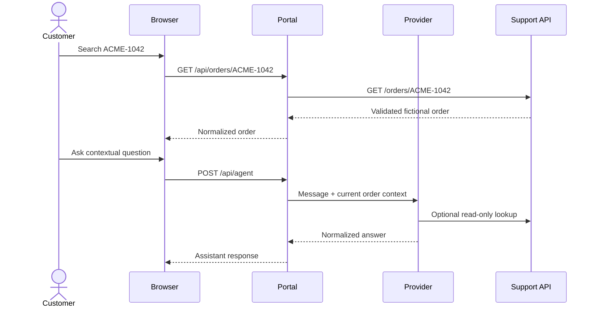

# Architecture

The lab keeps five concerns separate so that a convenient demo cannot silently
become a production claim.

## Product plane

The Next.js portal owns browser interaction. Its route handlers call the
Support API and the selected assistant provider. Backend URLs and bearer
credentials remain server-side. The browser receives only normalized product
responses.

## Agent plane

The default provider is deterministic and local. The optional provider calls a
watsonx Orchestrate agent only when explicitly selected and fully configured;
it does not fall back to the stub after an integrated failure.

The optional Draft package contains one read-only order tool and one fictional
return-policy knowledge base. Tenant import remains a human-owned operation.

## Delivery plane

The v0.1.0 source intentionally stops before merge, signing, tagging, or
publication. Its release audit binds an exact Git SHA to redacted check output,
calculates clean-archive and evidence digests, and leaves the decision and any
external operation to a human maintainer.

## Verification plane

Vitest checks pure logic and server boundaries. Playwright performs the primary
customer journey and a bounded invalid/missing-order path against real development
and production-build processes. The E2E configurations start only loopback services
with a secret-free environment and reject external browser origins.

## Trust plane

- local defaults require no secret;
- Orchestrate and Support API tokens are server-only;
- HTTP is permitted only on loopback;
- outbound redirects are denied at credential-bearing boundaries;
- inputs and external responses are schema-validated and bounded;
- telemetry is opt-in and application-only;
- sample evidence is labeled synthetic;
- no unfinished check is reported as passing.

## Data flow

