# Case study: an AI assistant delivery path with IBM Bob and watsonx Orchestrate ADK

## Purpose

This independent educational case study shows a reviewable path from a bounded
customer-support requirement to release evidence:

1. a human defines the outcome, Draft-only target, and non-negotiable guardrails;
2. IBM Bob IDE starts from the supplied backend, read-only tool, knowledge base,
   native-agent template, fixtures, and validation scripts;
3. Bob helps materialize and validate the model-specific definition and, only after
   separate human authorization, import the reviewed agent into watsonx Orchestrate
   Draft;
4. the existing portal is pointed at that selected WXO agent through its server-side
   adapter;
5. an optional guided path can send Support API traces directly to Instana over
   OTLP/HTTP without installing a system agent or collector;
6. deterministic CI produces the release-gate result;
7. Bob Shell may later add a non-interactive, bounded advisory review; and
8. a human makes the release decision for one exact candidate.

The example product is a fictional Acme support portal. Its assistant can look up
an order through a read-only tool, explain a fictional return policy, and direct a
user to a human-controlled support-case form. It cannot approve a refund or create
a case autonomously.

## What this repository proves today

| Capability | Current evidence boundary |
| --- | --- |
| Portal, Support API, and local assistant | Implemented and covered by deterministic local tests |
| watsonx Orchestrate ADK assets | Versioned, materialized, and validated offline |
| Draft import | Prepared and documented; authenticated tenant import is `not_asserted` |
| Portal-to-WXO connection | Server-side adapter and guided configuration exist; authenticated tenant routing is `not_asserted` |
| Live deployment | Out of scope and `not_asserted` |
| Instana direct OTLP | Opt-in guided path and local wire behavior exist; tenant receipt, indexing, and search are `not_asserted` |
| Deterministic CI | Implemented in GitHub Actions without an IBM account |
| Bob Shell review in CI/CD | Manual exact-SHA controller and contract tests implemented; authenticated status is established per candidate by its validated workflow artifact |
| Final release decision | Reserved for a human maintainer |

“Prepared for Draft import” is deliberately narrower than “deployed.” The current
candidate contains no proof that a watsonx Orchestrate tenant accepted the package,
that a live agent invoked the tool or knowledge base, or that any production user
interacted with it.

## Delivery flow

```mermaid
flowchart LR
  Requirement[Human requirement and Draft-only guardrails] --> Bob[IBM Bob IDE workshop stage]
  Ready[Ready portal, API, tool, knowledge, and template] --> Bob
  Bob --> Local[Model-specific materialization and offline validation]
  Local -. separately authorized .-> Draft[watsonx Orchestrate Draft import]
  Draft -. selected runtime configuration .-> Portal[Existing portal WXO adapter]
  Portal --> API[Support API]
  API -. opt-in direct OTLP .-> Instana[Instana blue SaaS]
  Local --> CI[Deterministic CI gates]
  CI --> Shell[Later bounded Bob Shell review]
  Shell --> Evidence[Sanitized evidence for one exact SHA]
  CI --> Evidence
  Draft -. separate import evidence .-> Evidence
  Portal -. separate routing evidence .-> Evidence
  Instana -. separate tenant observation .-> Evidence
  Evidence --> Decision{Human GO or NO-GO}
  Decision -. separate authorization .-> Release[Tag or publish]
```



The dotted edges are optional account-backed operations. They are not performed by
the default local workflow or by the current CI configuration.

## Stage 1: define the bounded use case

The human-owned requirement is intentionally small: help a user understand a
fictional order and return policy without giving the assistant transaction authority.
The repository-level controls require synthetic data, server-side credentials,
read-only tenant work, and an explicit stop before import, deployment, tagging, or
publication unless the exact operation is authorized.

This boundary is part of the implementation, not just presentation copy. The ADK
tool declares read-only permission, validates the order identifier and response
schema, limits response size and timeout, follows no redirects, and returns safe
failure categories.

## Stage 2: build the Draft agent in IBM Bob IDE from ready components

The first hands-on build stage does not ask a participant to implement a backend
from scratch. The package under `agents/store_support_agent` already contains:

- `agents/store_support_agent.template.yaml` — the native-agent template with a
  tenant-selected model placeholder and bounded starter prompts;
- `tools/get_order_status.py` — a read-only Python tool for the ready Support API;
- `knowledge_bases/acme_return_policy.yaml` and `knowledge/return-policy.txt` —
  the fictional policy source;
- offline cases and Python tests; and
- bounded scripts for local validation and materialization.

The intended Bob IDE choreography is:

1. open the repository and give Bob the bounded workshop requirement and repository
   instructions;
2. use Plan mode to inspect the supplied template, tool, knowledge, backend contract,
   and validation scripts before changing or running anything;
3. have a human approve the Draft-only plan and select a model confirmed as available
   in the authorized environment;
4. materialize the model-specific definition into the ignored `.generated` directory;
5. run offline validation and inspect the generated definition and results; and
6. only after a separate human authorization naming the active Draft target, use the
   current Bob/ADK workflow to import that reviewed definition into Draft.

The repository-owned commands for the credential-free part are:

```text
npm run install:project
npm run verify:agent
uv run --project agents/store_support_agent python agents/store_support_agent/scripts/materialize_agent.py --model-id "<tenant-confirmed-model-id>" --output agents/store_support_agent/.generated/store_support_agent.yaml
```

Offline validation does not contact watsonx Orchestrate. Materialization proves only
that the definition was produced and passed repository checks. Draft import is a
separate tenant write and needs its own observed, sanitized evidence; it is never
evidence of Live deployment, tool invocation, or knowledge retrieval.

IBM documents Plan, Agent, and Ask modes for planning, implementation, and
explanation respectively. IBM also documents **Build with Bob** for creating,
validating, and importing agent assets. See the official
[IBM Bob overview](https://bob.ibm.com/docs/ide),
[modes documentation](https://bob.ibm.com/docs/ide/features/modes),
[Building agents with IBM Bob](https://www.ibm.com/docs/en/watsonx/watson-orchestrate/base?topic=agents-building-bob),
and [ADK agent import guidance](https://developer.watson-orchestrate.ibm.com/agents/import_agent).

IBM documents that import places an agent in the active environment as Draft and
that deployment to Live is a separate operation. Before import, the operator must
confirm the account, workspace, active environment, connection, selected model, and
authorization; review all generated assets; and use fictional data. This workshop
stops at Draft.

## Stage 3: connect the existing portal to the selected Draft agent

After an independently evidenced Draft import, the participant starts the existing
portal and Support API rather than generating a second application. Run
`npm run guided`, select the account-backed WXO profile, and enter the endpoint,
agent ID, and API key only through the interactive runtime prompts. The key stays
server-side and is not written to a repository file.

The guided launcher sends chat requests to the selected agent. It does not import an
agent, determine whether the remote resource is Draft or Live, configure its
connection, deploy it, or promote it. A successful response marked
`source=orchestrate` is evidence of adapter routing for that run only. Tool invocation
and knowledge retrieval require separate direct evidence.

The cloud agent cannot reach the launcher's loopback Support API. A tenant-side
`acme_support_api` connection used for a real tool exercise therefore needs a
separately reviewed, authenticated HTTPS endpoint; that hosting boundary is not
provided by this repository.

## Stage 4: optionally observe the Support API with direct Instana OTLP

The same guided launcher can explicitly enable application-trace export from the
Support API to the fixed Instana blue SaaS OTLP/HTTP endpoint. It asks for a
synthetic logical host and an Instana Agent Key through a masked prompt, creates a
unique safe correlation ID, and scopes the key to the Support API child process.
This direct application export does not install a system Instana agent or an
OpenTelemetry collector.

This telemetry covers the Support API, not the WXO service or the agent's internal
reasoning, tool use, or retrieval. An exporter diagnostic supports only an export
attempt. Tenant receipt, indexing, and trace-search visibility need a separate
read-only observation tied to the same sanitized correlation ID.

## Stage 5: make deterministic checks the CI authority

The checked-in CI workflow runs without IBM tenant credentials. It verifies the
web application and ADK package, scans current and reachable Git content, audits
dependencies, builds the application, and exercises both development and
production-build browser profiles.

The authoritative automated outcome comes from commands with explicit exit codes,
schemas, assertions, and candidate-bound evidence. An advisory review cannot convert
a failed, missing, or unfinished deterministic check into a pass.

IBM's ADK CI/CD guidance likewise describes version-controlled agent definitions,
test and security gates, Draft testing, approval boundaries, and a separate Live
promotion. See the official [watsonx Orchestrate CI/CD deployment approach](https://developer.watson-orchestrate.ibm.com/tutorials/ci_cd/deployment-cicd-approach-3).

## Stage 6: add Bob Shell as a later advisory outer-loop review

IBM documents `bob run` for non-interactive automation and CI/CD, including JSON
and streaming JSON output plus cost and turn limits. In this case study, its safe
role is to inspect the complete tracked source of one exact candidate together with
a fixed same-run record listing the deterministic commands that passed, then produce
findings for a human. It does not receive a selected diff, pull-request scope, test
logs, or sanitized test summaries. It does not replace the tests, approve a pull
request, deploy an agent, or decide whether to release.

The repository includes the optional controller but intentionally does not commit
generated Bob reports. A review claim must instead be matched to the exact candidate
SHA and validated artifact of the protected workflow run. The control model is
documented in [Bob Shell in CI/CD](bob-shell-cicd.md). Official references include the
[Bob Shell overview](https://bob.ibm.com/docs/shell) and
[non-interactive sessions](https://bob.ibm.com/docs/shell/getting-started/start-bobshell-non-interactive).

## Stage 7: retain human release ownership

The release audit can produce a technical recommendation and a complete evidence
bundle for one exact Git SHA. It cannot check legal ownership, approve public
claims, import or deploy tenant assets, merge, tag, or publish. Those decisions stay
with the maintainer and are recorded through the release checklist.

This is the central engineering claim of the case study:

> IBM Bob IDE can turn reviewed, versioned building blocks into a Draft agent;
> the existing portal can connect to that selected agent; deterministic automation
> produces test evidence; Bob Shell can later add an advisory review; and a human
> remains accountable for every tenant and release decision.

## Reproduction boundaries

Anyone can reproduce the local mock application, offline ADK validation,
deterministic CI commands, and browser tests from the public source without an IBM
account. Reproducing the IBM-connected stages requires the reader's own licensed
products, current entitlements, credentials, and explicit authorization.

Do not combine source validation, Draft import, portal routing, tool invocation,
knowledge retrieval, Instana receipt, Bob Shell execution, or Live deployment into
one broad success claim. Each statement requires its own observed, candidate-bound
evidence; Live remains outside this workshop.

## Independence and trademarks

This is an independent community project. It is not an IBM product and is not
sponsored, endorsed, supported, or maintained by IBM. Text-only product references
are used to identify the technologies discussed. See IBM's official
[copyright and trademark information](https://www.ibm.com/legal/copyright-trademark)
and this repository's `TRADEMARKS.md`.
