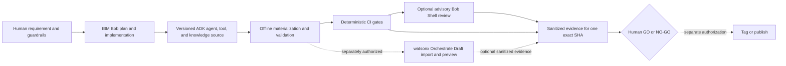

# Case study: an AI assistant delivery path with IBM Bob and watsonx Orchestrate ADK

## Purpose

This independent educational case study shows a reviewable path from a bounded
customer-support requirement to release evidence:

1. a human defines the outcome and non-negotiable guardrails;
2. IBM Bob can assist planning and implementation in the IDE;
3. the watsonx Orchestrate agent, tool, and knowledge definitions are stored as
   versioned source;
4. local checks validate those artifacts without contacting a tenant;
5. a maintainer may separately import a reviewed package into a watsonx
   Orchestrate Draft environment;
6. deterministic CI produces the release-gate result;
7. Bob Shell may add a non-interactive, advisory review;
8. a human makes the release decision for one exact candidate.

The example product is a fictional Acme support portal. Its assistant can look up
an order through a read-only tool, explain a fictional return policy, and direct a
user to a human-controlled support-case form. It cannot approve a refund or create
a case autonomously.

## What this repository proves today

| Capability | Current evidence boundary |
| --- | --- |
| Portal, Support API, and local assistant | Implemented and covered by deterministic local tests |
| watsonx Orchestrate ADK assets | Versioned, materialized, and validated offline |
| Draft import | Prepared and documented; authenticated tenant import is `not_asserted` |
| Live deployment | Out of scope and `not_asserted` |
| Deterministic CI | Implemented in GitHub Actions without an IBM account |
| Bob Shell review in CI/CD | Manual exact-SHA controller and contract tests implemented; authenticated execution is `not_completed` |
| Final release decision | Reserved for a human maintainer |

“Prepared for Draft import” is deliberately narrower than “deployed.” The current
candidate contains no proof that a watsonx Orchestrate tenant accepted the package,
that a live agent invoked the tool or knowledge base, or that any production user
interacted with it.

## Delivery flow



The dotted edges are optional account-backed operations. They are not performed by
the default local workflow or by the current CI configuration.

## Stage 1: define the bounded use case

The human-owned requirement is intentionally small: help a user understand a
fictional order and return policy without giving the assistant transaction authority.
The repository-level controls require synthetic data, server-side credentials,
read-only tenant work, and an explicit stop before import, deployment, tagging, or
publication unless the exact operation is authorized.

This boundary is part of the implementation, not just presentation copy. The ADK
tool declares read-only permission, validates the order identifier and response
schema, limits response size and timeout, follows no redirects, and returns safe
failure categories.

## Stage 2: use IBM Bob as a development assistant

The intended IDE choreography is:

1. provide the business requirement and repository instructions;
2. use Plan mode to inspect and propose a design before implementation;
3. have a human review the plan and authorize the bounded change;
4. use Agent mode for implementation and focused tests;
5. inspect the diff and findings before accepting the candidate.

IBM documents Plan, Agent, and Ask modes for planning, implementation, and
explanation respectively. IBM also documents an IDE Review workflow that analyzes
branch differences and presents findings, while recommending automated review as a
first pass before human review. See the official [IBM Bob overview](https://bob.ibm.com/docs/ide),
[modes documentation](https://bob.ibm.com/docs/ide/features/modes), and
[code-review documentation](https://bob.ibm.com/docs/ide/features/code-reviews).

IBM also documents **Build with Bob**, which can initialize a watsonx Orchestrate
workspace and help create, modify, validate, import, or deploy agent assets through
natural-language instructions. The one-click launch integration is documented as a
Preview feature for watsonx Orchestrate SaaS on AWS and IBM Cloud. This repository
does not treat feature availability as evidence of a completed external run. See
[Building agents with IBM Bob](https://www.ibm.com/docs/en/watsonx/watson-orchestrate/base?topic=agents-building-bob).

## Stage 3: keep agent assets reviewable in Git

The package under `agents/store_support_agent` contains:

- `agents/store_support_agent.template.yaml` — the native-agent template with a
  tenant-selected model placeholder;
- `tools/get_order_status.py` — a read-only Python tool for the Support API;
- `knowledge_bases/acme_return_policy.yaml` and `knowledge/return-policy.txt` —
  the fictional policy source;
- offline cases and Python tests;
- bounded scripts for local validation and materialization.

This makes behavior, restrictions, tool contracts, and knowledge inputs reviewable
alongside the application. No credential, tenant identifier, tenant export, or IBM
binary is included.

IBM describes the ADK as a developer-focused toolkit for building, testing, and
managing agents with YAML or JSON definitions, Python tools, and a CLI. Official
references cover [getting started with the ADK](https://developer.watson-orchestrate.ibm.com/getting_started/installing),
[importing agents](https://developer.watson-orchestrate.ibm.com/agents/import_agent),
and [importing Python or OpenAPI tools](https://developer.watson-orchestrate.ibm.com/tools/deploy_tool).

## Stage 4: validate locally before any tenant write

The repository first installs locked dependencies, validates the checked-in
illustrative agent definition and its relationship to the template, exercises the
real local HTTP boundary of the read-only tool, and runs the Python test suite:

```text
npm run install:project
npm run verify:agent
```

These checks do not contact watsonx Orchestrate. A successful local result proves
only that the checked-in package satisfies the repository's offline contracts.

Before a possible import, the maintainer must choose a model that is available in
the intended tenant and create a reviewed generated definition:

```text
uv run --project agents/store_support_agent python agents/store_support_agent/scripts/materialize_agent.py --model-id "<tenant-confirmed-model-id>" --output agents/store_support_agent/.generated/store_support_agent.yaml
```

## Stage 5: prepare for a separately authorized Draft import

IBM documents that importing an agent transfers its configuration to the active
environment in a Draft, undeployed state. Deployment is a separate operation that
moves a Draft agent to Live. The two states must not be conflated. See
[Importing and deploying agents](https://developer.watson-orchestrate.ibm.com/agents/import_agent)
and [watsonx Orchestrate environments](https://www.ibm.com/docs/en/watsonx/watson-orchestrate/base?topic=agents-environments).

This repository intentionally stops before the tenant write. An operator choosing
to continue must confirm the account, tenant, workspace, active environment,
connections, selected model, and authorization; review all generated assets; use
fictional data; and retain sanitized evidence tied to the candidate SHA. Draft
import must not be described as Live deployment.

## Stage 6: make deterministic checks the CI authority

The checked-in CI workflow runs without IBM tenant credentials. It verifies the
web application and ADK package, scans current and reachable Git content, audits
dependencies, builds the application, and exercises both development and
production-build browser profiles.

The authoritative automated outcome comes from commands with explicit exit codes,
schemas, assertions, and candidate-bound evidence. An advisory review cannot convert
a failed, missing, or unfinished deterministic check into a pass.

IBM's ADK CI/CD guidance likewise describes version-controlled agent definitions,
test and security gates, Draft testing, approval boundaries, and a separate Live
promotion. See the official [watsonx Orchestrate CI/CD deployment approach](https://developer.watson-orchestrate.ibm.com/tutorials/ci_cd/deployment-cicd-approach-3).

## Stage 7: add Bob Shell as an advisory outer-loop review

IBM documents `bob run` for non-interactive automation and CI/CD, including JSON
and streaming JSON output plus cost and turn limits. In this case study, its safe
role is to inspect the complete tracked source of one exact candidate together with
a fixed same-run record listing the deterministic commands that passed, then produce
findings for a human. It does not receive a selected diff, pull-request scope, test
logs, or sanitized test summaries. It does not replace the tests, approve a pull
request, deploy an agent, or decide whether to release.

The repository includes the optional controller, but does not contain evidence of an
authenticated Bob Shell run for this candidate. Its control model and rehearsal are documented in
[Bob Shell in CI/CD](bob-shell-cicd.md). Official references include the
[Bob Shell overview](https://bob.ibm.com/docs/shell) and
[non-interactive sessions](https://bob.ibm.com/docs/shell/getting-started/start-bobshell-non-interactive).

## Stage 8: retain human release ownership

The release audit can produce a technical recommendation and a complete evidence
bundle for one exact Git SHA. It cannot check legal ownership, approve public
claims, import or deploy tenant assets, merge, tag, or publish. Those decisions stay
with the maintainer and are recorded through the release checklist.

This is the central engineering claim of the case study:

> IBM Bob can assist development, watsonx Orchestrate ADK makes agent assets
> versionable, deterministic automation produces test evidence, Bob Shell can add
> an advisory review, and a human remains accountable for release.

## Reproduction boundaries

Anyone can reproduce the local mock application, offline ADK validation,
deterministic CI commands, and browser tests from the public source without an IBM
account. Reproducing the IBM-connected stages requires the reader's own licensed
products, current entitlements, credentials, and explicit authorization.

Do not publish Draft import, tool invocation, knowledge retrieval, or Live deployment
claims unless a separate observed run provides candidate-bound evidence for that
exact statement.

## Independence and trademarks

This is an independent community project. It is not an IBM product and is not
sponsored, endorsed, supported, or maintained by IBM. Text-only product references
are used to identify the technologies discussed. See IBM's official
[copyright and trademark information](https://www.ibm.com/legal/copyright-trademark)
and this repository's `TRADEMARKS.md`.
