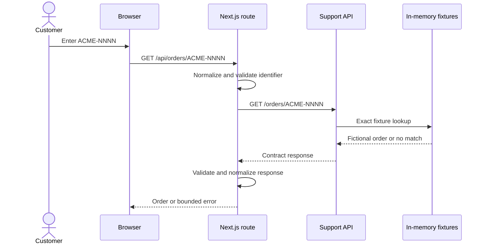
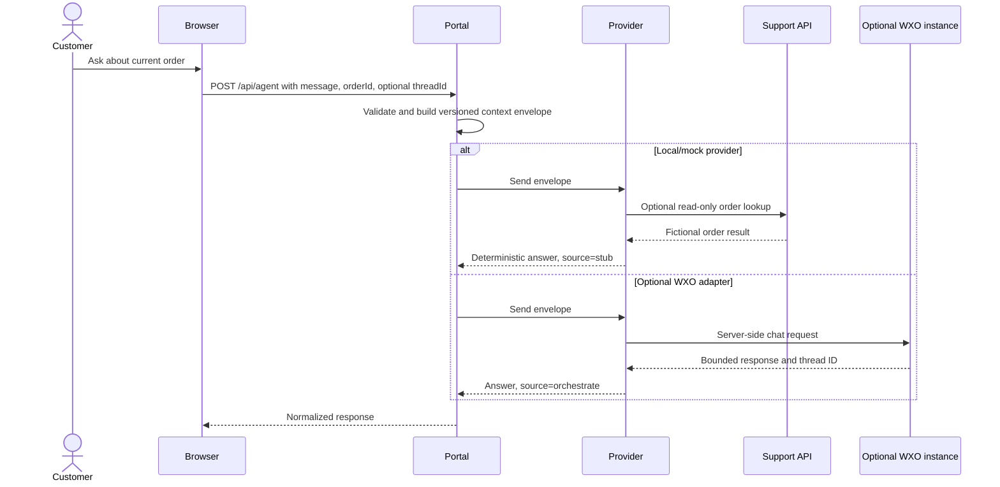
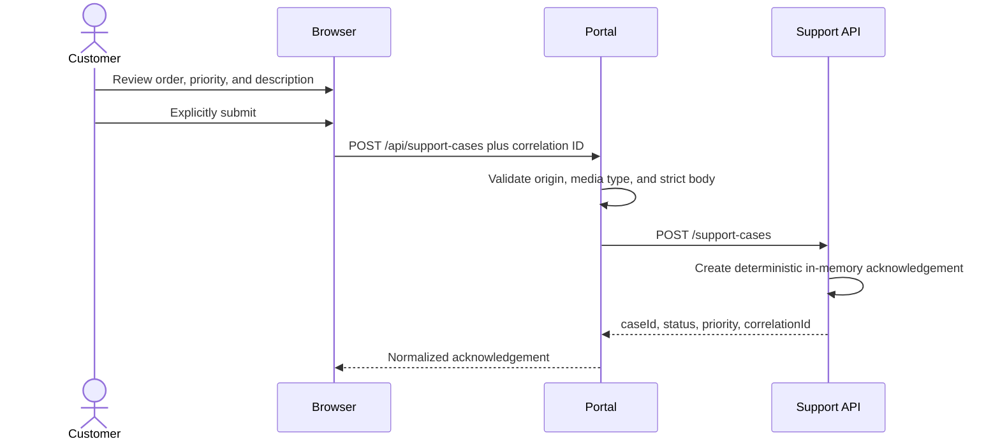

# Data flow

## Order lookup

## Assistant request

The WXO branch is source-level and `not_asserted` for v0.1.0. Even when routing is
observed, tool invocation and knowledge retrieval require separate direct evidence.

## Support-case acknowledgement

The acknowledgement is not durable storage, ticket-system integration, or proof
that a human support team received a case.

## Telemetry flow

When telemetry is enabled, the Support API creates application HTTP spans and sends
them to a configured OTLP/HTTP endpoint. Instana credentials remain in server
configuration and exporter headers. The implementation intentionally avoids host
resource discovery and does not export application logs or metrics.

## Data classification and retention

| Data | Classification | Location and lifetime | Evidence rule |
| --- | --- | --- | --- |
| Acme order records | Fictional | Immutable API process fixtures | May appear in sanitized local evidence |
| Product presentation and addresses | Fictional | Portal source and browser rendering | May appear in owned screenshots |
| Assistant message | User input; potentially sensitive if misused | Browser state and transient provider request | Use fictional content only; do not preserve raw private prompts |
| Assistant thread ID | Opaque runtime identifier | Browser state and WXO request header | Sanitize before evidence |
| Support-case description | User input | Transient browser/API request; no database | Use fictional content only |
| Correlation ID | Bounded diagnostic identifier | Request headers, response, logs, and spans | May be retained when synthetic and sanitized |
| WXO API key/access token | Secret | Server environment and in-process token cache | Never include in evidence or browser output |
| Support API token | Secret when configured | Server environment and Authorization header | Never include in evidence or logs |
| Instana key | Secret | Server environment and exporter header | Never include in evidence or diagnostics |
| Traces | Operational metadata | OTLP collector or tenant when enabled | Retention and access are operator-owned; external state `not_asserted` |

## Trust boundaries

1. Browser to Next.js same-origin routes.
2. Next.js server routes to the Support API.
3. Portal server to WXO IAM and agent endpoints when explicitly configured.
4. Imported Draft tool to an operator-configured Support API endpoint.
5. Support API to an OTLP collector when explicitly configured.
6. Local source and test output to any retained release-evidence bundle.

Crossing a boundary must not turn untrusted input or upstream payloads into an
unbounded response, secret-bearing log, or unsupported release claim.
