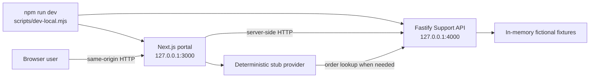
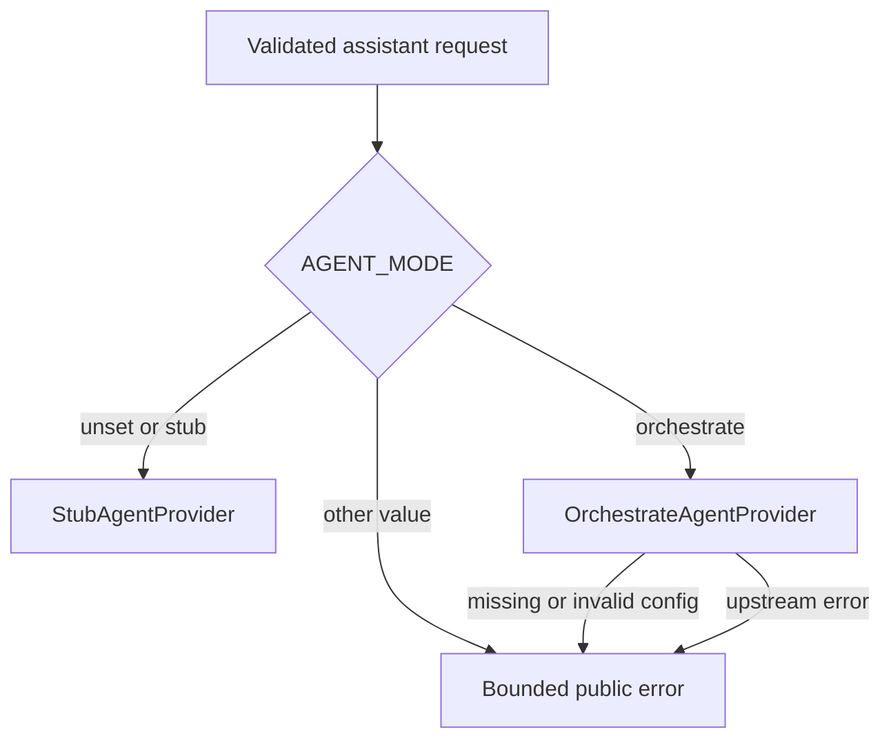

# Runtime flow

## Local/mock process topology

`npm run dev` validates the selected ports, starts both workspace development
commands, forces the portal to `AGENT_MODE=stub`, disables API authentication and
telemetry for the local profile, and supplies a fixed demonstration correlation ID.
If either child exits unexpectedly, the launcher asks the other child to stop.

## Guided foreground launcher

`npm run guided` is a separate operator-facing flow. It validates the two loopback
ports, asks for either the local `stub` profile or explicitly selected account-backed WXO
configuration, shows a summary without credentials, and asks what to open/start.
The mock selection delegates to the safe root launcher above. The WXO selection
starts the same two workspace processes directly with `AGENT_MODE=orchestrate` and
server-only WXO values. The Support API remains loopback-only, authentication and
telemetry remain disabled, and no `.env` file is accepted.

After readiness checks, the guided launcher can open the portal, API health, the
case-study/workshop documents, the Bob Shell control guide, and the fictional
screenshot as browser previews. A terminal menu stays active until the operator
chooses `0` or cancels. The flow performs no WXO import, deployment, Live
promotion, Bob Shell run, or release action.

## Portal request routing

| Browser request | Portal behavior | Downstream behavior |
| --- | --- | --- |
| `GET /` | Renders the customer portal | None |
| `GET /api/health` | Returns portal readiness metadata | None |
| `GET /api/orders/{orderId}` | Normalizes and validates `ACME-NNNN` | Server-side `GET /orders/{orderId}` to Support API |
| `POST /api/agent` | Validates same-origin JSON, message, order context, and thread ID | Selects stub or WXO provider |
| `POST /api/support-cases` | Validates same-origin JSON and strict request shape | Server-side `POST /support-cases` to Support API |

The browser never receives the configured Support API token, WXO API key, or WXO
access token.

## Assistant provider selection

The integrated provider does not silently fall back to the stub after an error. A
successful response labeled `source=orchestrate` establishes routing through the
adapter; it does not by itself establish Draft or Live status, an internal tool
call, or retrieval.

## Support API lifecycle

The API loads and validates configuration, initializes optional telemetry before
loading Fastify, builds routes, and then listens on the configured host and port.
The default is loopback. A non-loopback bind is rejected unless bearer protection
is explicitly enabled with a non-empty token.

On `SIGINT` or `SIGTERM`, the API closes Fastify and attempts a bounded telemetry
shutdown. Telemetry exporter failure is treated as best-effort and must not convert
an otherwise clean application shutdown into a successful evidence claim.

## Profiles not supplied by the default root launcher

- The default `npm run dev` launcher has no integrated WXO mode; use the explicit
  `npm run guided` flow for an authorized account-backed chat request. Verify Draft
  or Live status separately in the tenant; the launcher does not infer it.
- There is no replay process.
- There is no production supervisor or combined built-artifact start command.
- There is no Forgejo or always-on Bob worker. An optional GitHub workflow can use a
  separately administered ephemeral Bob Shell runner after manual exact-SHA dispatch.
- There is no automatic import, deployment, or Live promotion process.

Those absences are deliberate v0.1.0 scope boundaries, not implicit future
capabilities.
