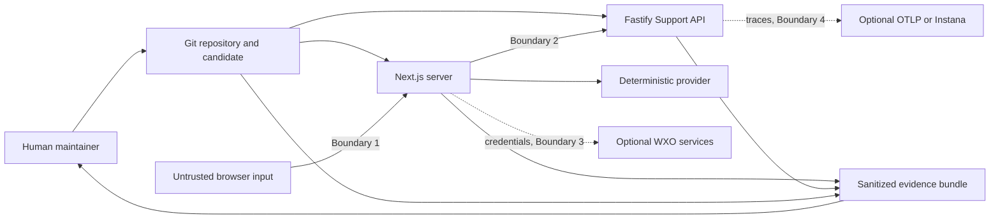

# Threat model

## Scope and assumptions

This threat model covers the v0.1.0 local/mock portal, Support API, repository
verification, and the boundaries exposed by optional source-level adapters. It
assumes fictional data and a single-user demonstration machine. Production hosting,
tenant administration, Forgejo, replay, and WXO Live are outside scope.

The model identifies controls and verification work. It does not claim that a
security test, external assessment, or tenant acceptance completed.

## System and trust boundaries

## Threat actors

- A user supplying malformed, oversized, cross-origin, or deceptive input.
- A contributor introducing unsafe code, misleading evidence, or a dependency.
- A compromised package publisher or CI action.
- A malicious or compromised external endpoint attempting redirect or data capture.
- An operator accidentally exposing a local compatibility profile externally.
- An AI system producing plausible but unsupported implementation or release claims.
- A maintainer accidentally publishing credentials, tenant data, or generated caches.

## Threat analysis

| Category | Threat | Existing control | Remaining gap or required evidence |
| --- | --- | --- | --- |
| Spoofing | Unauthorized use of an externally bound Support API | Non-loopback bind requires bearer configuration; timing-safe token check | Production IAM, rotation, rate limits, and TLS termination are out of scope |
| Spoofing | Malicious endpoint impersonates WXO | HTTPS, restricted hostname/path, rejected redirects | Tenant identity and certificate-path behavior require an authorized live observation |
| Tampering | `priority` contract is silently changed | Strict schemas and explicit tests reject `priorityLevel` | Release audit must run against the exact candidate and archive |
| Tampering | Evidence is edited or belongs to another commit | Audit rechecks source state, validates the clean-archive SHA, checksum-binds the report, and writes a completion marker last without overwriting a candidate | No signed evidence bundle or attestation |
| Repudiation | Release occurs without attributable human approval | Governance assigns the decision to maintainers | No executable approval gate or immutable approval record |
| Information disclosure | Credential reaches browser or public log | Server-only adapters, no public credential variables, normalized expected errors | Unexpected dependency/runtime logging and external platform logs require review |
| Information disclosure | Redirect forwards a bearer token | Redirects are rejected or not followed | DNS, proxy, and TLS infrastructure remain operator-controlled |
| Information disclosure | Private data enters prompts, traces, screenshots, or evidence | Fictional-data rule and evidence privacy policy | Human review is still required; no complete DLP control exists |
| Denial of service | Oversized request or upstream response consumes resources | Bounded input schemas, response-size limits, and timeouts | No load, concurrency, or sustained-resource test is asserted |
| Denial of service | OTLP collector stalls shutdown | Short exporter timeout and bounded shutdown | Exporter backpressure under sustained load is not assessed |
| Elevation of privilege | Local no-auth profile is bound externally | Startup configuration fails closed for non-loopback without auth | Production network policy and deployment manifests do not exist |
| Supply chain | Compromised npm, Python, browser, or CI dependency | Lockfiles, direct pins, action commit pins, read-only CI, vulnerability audits, and combined SBOM | No signature policy, provenance verification, human-complete license review, or observed host automation is asserted |
| Repository history | Deleted secret or private metadata remains in an old blob/ref | Reachable-history scanner covers blobs, paths, and direct commit email counts | Unfetched/unreachable objects, revocation decisions, and release attachments require separate review |
| Injection | Assistant is manipulated by user content | Input bounds, explicit agent instructions, read-only Draft tool | Model behavior and tool-selection provenance require separate evaluation |
| XSS | Assistant or API text becomes executable markup | React renders response text as text; responses are schema-normalized | Browser security headers do not replace a dedicated application-security review |
| CSRF | Cross-site form submits a case or agent message | Portal POST routes check Origin when supplied and require JSON | Deployment proxy behavior and requests without Origin require review for each hosting profile |
| SSRF | Configurable backend URL reaches an unsafe host | Plain HTTP limited to loopback; WXO hostname restricted; redirects disabled | Generic HTTPS Support API and OTLP endpoints remain operator-selected |

## High-value abuse cases

1. A contributor adds a real `.env`, tenant export, authenticated screenshot, or
   credential-like fixture and relies on `.gitignore` to hide it.
2. A release report reuses results from another SHA or reports a missing live test as
   successful.
3. A maintainer runs the local no-auth API on a non-loopback interface.
4. A WXO or Support API endpoint redirects a credential-bearing request.
5. An assistant answer is presented as proof of a tool invocation or retrieval.
6. A synthetic support-case acknowledgement is represented as a durable ticket.
7. Static fictional order data is represented as live carrier data.
8. An AI-generated change bypasses human review because its output appears complete.

## Required release checks derived from this model

- Bind all results to the exact candidate SHA and packaged bytes.
- Inspect current source, complete reachable history, generated archive, and release
  assets separately.
- Verify local bind and environment isolation.
- Exercise request validation, auth failure, redirect, timeout, and response-size
  boundaries.
- Run browser failure and recovery paths in addition to the primary journey.
- Review dependency inventories and required notices for both npm and Python.
- Keep optional external-service claims `not_asserted` without direct evidence.
- Require a final human decision after the evidence is complete.
